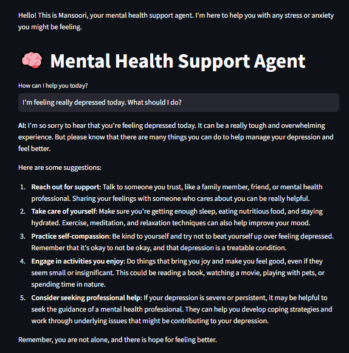

# 🧠 Mental Health Support Agent Chatbot

Welcome to the **Mental Health Support Agent**, an AI-powered chatbot built using **Streamlit** and **Ollama's LLaMA 3** model. This tool provides emotional support, positive affirmations, and guided meditation to help users manage stress, anxiety, and feelings of depression.

---

## 🏗️ Project Overview

This chatbot simulates a friendly and supportive conversation for individuals going through emotional challenges. Powered by **locally hosted LLMs** through Ollama, it ensures:

- ✅ Fast response time  
- ✅ Offline functionality  
- ✅ Enhanced privacy with no external API calls

---

## 🛠️ Tech Stack & Tools Used

| Tool / Library     | Purpose                                                |
|--------------------|--------------------------------------------------------|
| `Python`           | Core programming language                              |
| `Streamlit`        | Interactive frontend web interface                     |
| `Ollama`           | LLM runtime engine to run local models like `llama3`   |
| `llama3` model     | LLaMA 3 model used for generating AI responses         |
| `base64`           | For loading and embedding custom background images     |

---

## ✨ Features

- 💬 **Conversational chat** with memory support using `llama3`
- 🌟 **Positive affirmations** to uplift mental state
- 🧘 **5-minute guided meditation** responses
- 📜 Maintains **chat history** per session
- 🎨 **Custom background support** via base64 encoding

---

## 📷 Screenshot



---

## 🔧 Setup Instructions

### ✅ Requirements

- Python 3.8 to 3.11  
  (⚠️ Python 3.12 may not work with some packages like `tokenizers`)
- [Ollama](https://ollama.com/) installed on your system
- Pull the LLaMA3 model using:

```bash
ollama pull llama3
```
### How to install from requirements.txt
```bash
pip install -r requirements.txt
```
